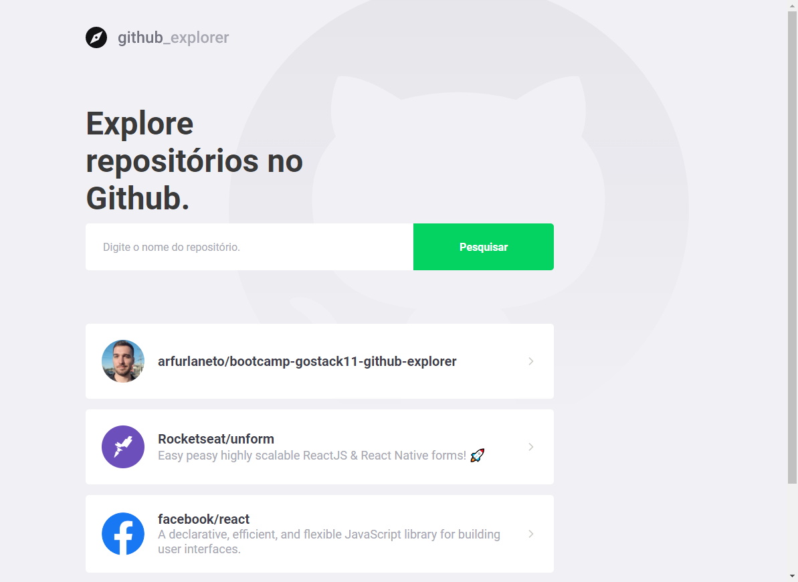
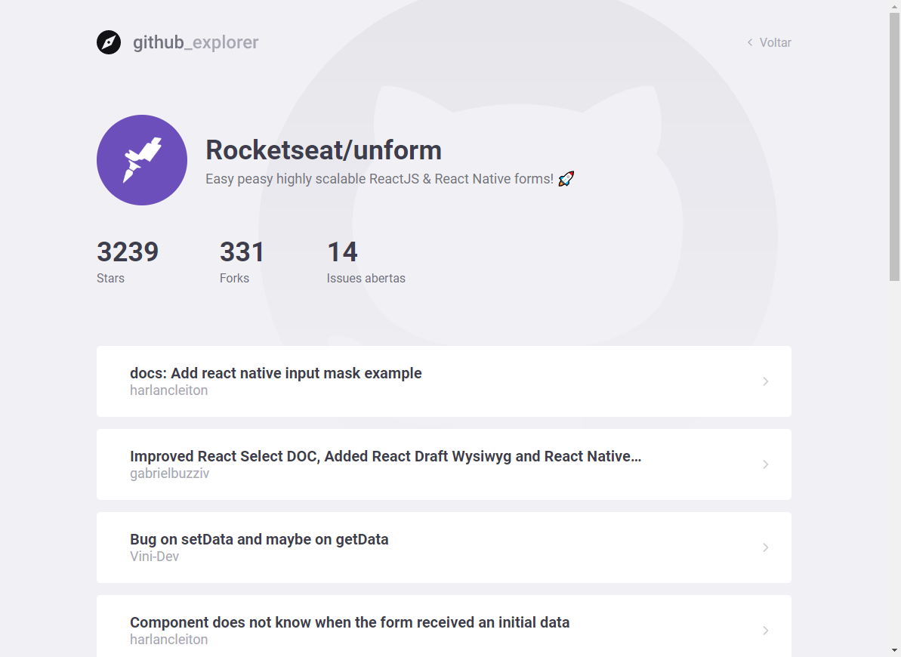

# About
**Github Explorer** is a simple application to bookmark Github repositories and see their issues.

This application was developed at Rocketseat's GoStack Bootcamp (https://rocketseat.com.br/bootcamp).
<p align="center">
  
</p>
<p align="center">
  
</p>

# Technologies
- React JS

# How to Use
Install the dependencies
```
yarn
```
StarT the application. It runs at port 3000.
```
yarn run start
```
